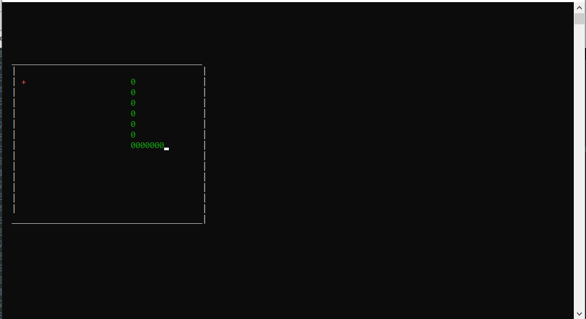

# Snake Game

A simple Snake game built in **2021**. It was developed in **one week** as a fun project.

## Screenshot

## How to Play

- Use the arrow keys to move the snake.
- Eat the red food to grow longer.
- Avoid colliding with the walls or yourself!

## Features

- Classic Snake gameplay
- Minimalistic graphics
- Simple mechanics

## Technologies Used

- **Language:** C

## Setup

1. Clone the repository
2. Compile the main file ( with a c compiler), and run its executable
